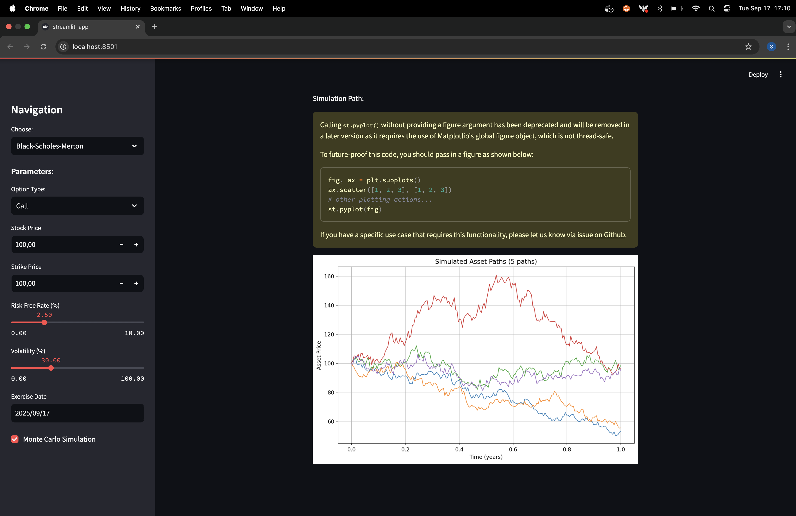

# Option Pricing Models in Streamlit

This repository implements financial option pricing models using both theoretical and simulation-based approaches. It features a web interface built with **Streamlit**, where users can interactively calculate option prices based on the **Black-Scholes-Merton** and **Merton Jump-Diffusion** models. 

## Features

- **Black-Scholes-Merton Model**: The classic option pricing model that calculates European option prices (Call/Put) based on analytical formulas.
- **Merton Jump-Diffusion Model**: An extended model that accounts for asset price jumps in addition to the continuous stochastic process.
- **Monte Carlo Simulation**: Allows for the simulation of option prices for both models by generating multiple asset paths.
- **Visualization**: Visualize simulated asset price paths with adjustable parameters.

## Installation

### Using Python

1. Clone the repository:
    ```bash
    git clone https://github.com/your_username/option_pricing.git
    ```

2. Navigate to the project directory:
    ```bash
    cd option_pricing
    ```

3. Install the required dependencies:
    ```bash
    pip install -r requirements.txt
    ```

4. Run the Streamlit app:
    ```bash
    streamlit run streamlit_app.py
    ```

### Using Docker

If you prefer to use Docker to run the app without worrying about the environment setup, follow these steps:

1. Clone the repository:
    ```bash
    git clone https://github.com/your_username/option_pricing.git
    ```

2. Navigate to the project directory:
    ```bash
    cd option_pricing
    ```

3. Build the Docker image:
    ```bash
    docker build -t pricing_options_app .
    ```

4. Run the Docker container:
    ```bash
    docker run -p 8501:8501 pricing_options_app
    ```

5. Access the app in your browser by navigating to:
    ```
    http://localhost:8501
    ```

This method ensures that anyone can run the application with consistent dependencies and environment settings, without manually installing Python packages.

## Usage

### Sidebar Inputs

Users can adjust various input parameters via the sidebar:

- **Option Type**: Choose between "Call" and "Put" options.
- **Stock Price**: The current price of the underlying stock.
- **Strike Price**: The option's strike price.
- **Risk-Free Rate**: The annual risk-free interest rate (in %).
- **Volatility**: The volatility of the underlying asset (in %).
- **Exercise Date**: The date when the option is exercised.
  
For the **Merton Jump-Diffusion** model, additional inputs are required:
  
- **Jump Intensity**: Average number of jumps per year.
- **Jump Mean**: Mean jump size.
- **Jump Volatility**: Volatility of the jump size (in %).

### Monte Carlo Simulation

Both models support Monte Carlo simulation for estimating option prices based on simulated asset paths. You can adjust the following parameters:

- **Sub-intervals**: Number of time steps in the simulation.
- **Simulations**: Number of simulated paths.
- **Paths to Plot**: Number of simulation paths to visualize.

### Models

#### Black-Scholes-Merton Model
- Calculates the option price using the theoretical Black-Scholes-Merton formula.
- Optionally simulate asset paths using the Monte Carlo method.

#### Merton Jump-Diffusion Model
- A more advanced model that includes price jumps in the option pricing process.
- Supports Monte Carlo simulation for estimating option prices under jumps.

## Example

1. Select **Black-Scholes-Merton** from the navigation dropdown.
2. Enter the parameters (e.g., Stock Price, Strike Price, Volatility).
3. Click **Calculate Theoretical Option Price** to get the analytical solution, or enable **Monte Carlo Simulation** to get a simulated price and visualize asset paths.

## Screenshots

| Theoretical Option Pricing | Simulated Asset Paths |
|----------------------------|-----------------------|
|  |  |

## License

This project is licensed under the MIT License - see the [LICENSE](LICENSE) file for details.

## Contributing

Contributions are welcome! Feel free to open issues or submit pull requests for improvements and new features.

## Contact

For questions or issues, please reach out via the [Issues](https://github.com/your_username/option_pricing/issues) page.
